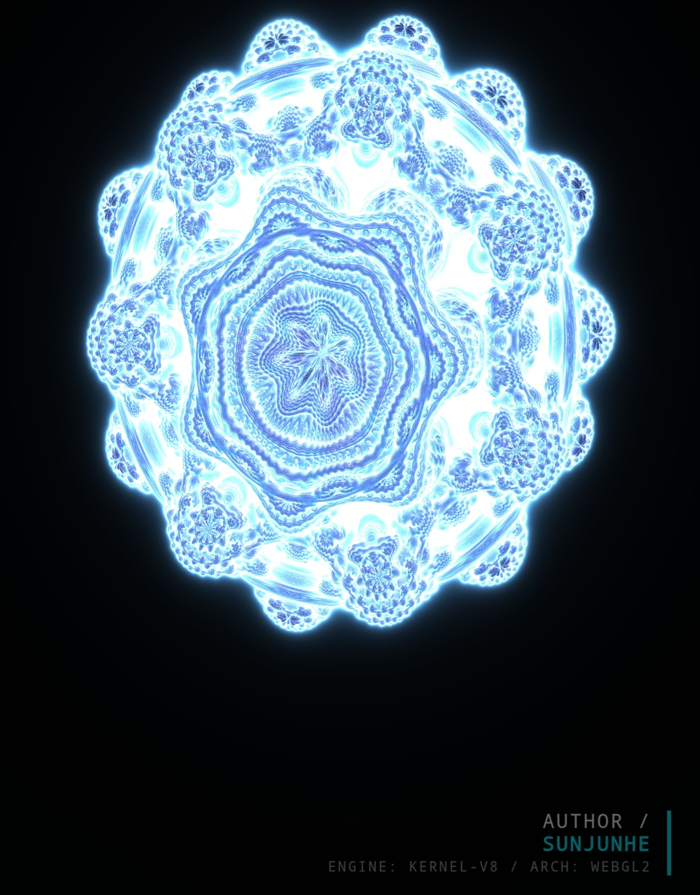

# ⚡️ Kernel-V8: GPU Architecture Stress Test

**Kernel-V8** is a high-performance GPU benchmarking engine built on the WebGL2 API. By rendering a complex 8th-order **Mandelbulb** fractal in real-time, it generates intense arithmetic workloads to evaluate the stability, thermal throttling, and peak compute throughput of modern graphics hardware.

  
   
  <i>Real-time 8th-order Mandelbulb rendering with Raymarching</i>

---

## 🚀 Getting Started

Kernel-V8 leverages modern **ES Modules (ESM)**. Due to browser CORS policies, the project must be served through a web server.

### Local Development
1. **VS Code**: Install the `Live Server` extension, right-click `index.html`, and select `Open with Live Server`.
2. **Python**: Run `python -m http.server 8080` in the root directory.
3. **Node.js**: Run `npx serve .`.

### Production
This is a purely static project. It can be deployed instantly to **GitHub Pages**, **Vercel**, or **Netlify** with zero configuration.

---

## 🛠 Engineering Architecture

The engine is designed with a strict "Compute-Logic Separation" philosophy to ensure modularity and scalability.

* **`core/engine.js`**: The low-level WebGL pipeline. Manages context initialization, program linking, and high-frequency uniform synchronization.
* **`core/interaction.js`**: The orchestration layer. Handles FPS monitoring, automated benchmark sequences, and user input (rotation/zoom).
* **`shaders/`**: The compute core. GLSL sources are encapsulated as JS modules for seamless loading without a build step.
* **`ui/style.css`**: A minimalist HUD system using CSS variables and `backdrop-filter` for a premium hardware-monitor aesthetic.

---

## 📐 Technical Deep-Dive

### 1. Fractal Iteration
The rendering core is based on the recursive 3D Mandelbulb formula:

$$z_{n+1} = z_n^n + c$$

In this engine, we utilize $n=8$. The transformation in spherical coordinates is defined as:
* $r = |z|$
* $\theta = \cos^{-1}(z.z / r) \cdot 8$
* $\phi = \tan^{-1}(z.y, z.x) \cdot 8$

### 2. Raymarching Implementation
Unlike traditional mesh-based rendering, Kernel-V8 uses **Raymarching** to find intersections pixel-by-pixel:

* **SDF (Signed Distance Function)**: Evaluates the shortest distance to the fractal surface.
* **Distance Estimation (DE)**: To prevent overshooting the fractal's intricate edges, we use the derivative-based estimation:
    $$d = \frac{0.5 \cdot \ln(r) \cdot r}{dr}$$

### 3. Compute Density Levels
Stress levels are dynamically controlled via `u_q` (Sampling) and `u_heavy` (Iteration Depth):
* **Balanced**: Optimized for mid-range GPUs and mobile devices.
* **Extreme (Turbo)**: Enables deep recursion and ultra-high step counts to maximize GPU core utilization.

---

## 📊 Performance Benchmarking

After a 20-second automated stress sequence, the engine generates a report based on **Average FPS**:

| FPS Range | Tier Evaluation | Performance Notes |
| :--- | :--- | :--- |
| **> 60 FPS** | **Ultra** | Flagship hardware. Exceptional FP32 throughput. |
| **30 - 60 FPS** | **High** | High-end hardware. Efficient pipeline execution. |
| **15 - 30 FPS** | **Medium** | Entry-level or mobile GPU. Computational bottleneck detected. |
| **< 15 FPS** | **Low** | Underperforming. Recommend lower Sampling Rate. |

---

## 📜 License

Distributed under the **MIT License**. See `LICENSE` for more information.

---
**Author**: SUNJUNHE  
**Kernel Version**: 8.2.0  
**Verified by**: SunJunhe Graphics Lab
